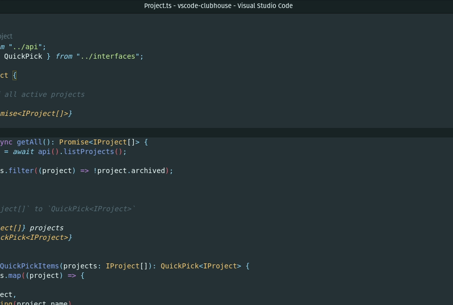

# VSCode Shortcut.com (Formerly Clubhouse.io)

A extension that adds shortcut.com integration with VSCode, the purpose of this extension is 
to use all the great features of Shortcut without ever needing to leave the code editor. This means developers can spend more time coding, and less time moving/maintaining stories.

<p align="center">
  
</p>

## Getting started

To use this extension you will need to provide a shortcut.com api key, you can generate one here https://app.shortcut.io/settings/account/api-tokens

This api key is stored locally in VSCode and is never shared with the outside world.

## Commands

| Command | Description |
|---|---|
| Set Base Branch | Set's the default base branch, when new features branches are created/merged, they will use the default branch as the base |
| Create Story | Creates a brand new story, this will ask for the various story details |
| Get Stories| Get's all stories currently assigned to you (separated by workflow) |
| Search Stories | Searches all stories in shortcut.com, this supports all the search operators used in the main shortcut app. [View the full list here](https://help.shortcut.com/hc/en-us/articles/360000046646-Searching-in-Clubhouse-Story-Search) |
| Create Commit | Pushes a new commit to the feature branch, and automatically creates the feature branch on remote |
| Create Pull Request | Opens the "create pull request" page on github, automatically selects the current feature branch and prefills the title and description. Note: This will not automatically open the PR this just saves you filling in some of the info yourself |

## Settings

**Branch Format**

This option enables you to change the default branch format when creating new branch, there are a couple of variable that can be added to the branch name
which will automatically be replaced with the corresponding data in shortcut, these are the values that are currently supported:

- `[story_id]` = sh1234
- `[story_type]` = feature
- `[owner_username]` = daniel
- `[story_name]` = example-story-name

Here is an example branch format:

```
[story_type]/[story_id]/[story_name]
```

## Working on this extension

To work on the extension locally, open this proejct in VSCode and press **F5**. This will open up a new instance of VSCode with the extension loaded.


## Running Github Actions locally

Install [act](https://github.com/nektos/act) and run the following command

```bash
act -P ubuntu-latest=node:16 --reuse
```
